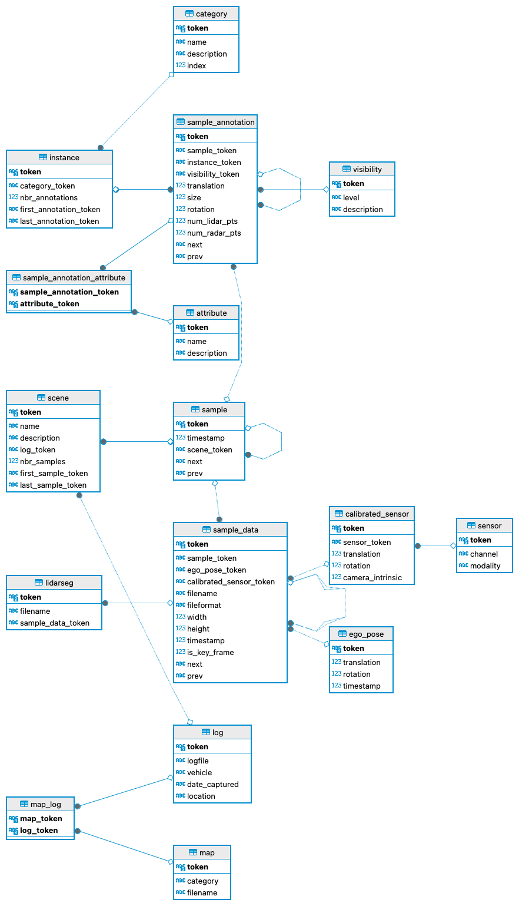

# NuScenes Schema SQLite

Create a SQLite database with the schema of the nuScenes dataset.
The nuScenes dataset is a large-scale dataset for autonomous driving research, containing high-definition sensor data collected by autonomous vehicles in urban environments.

For detailed information about the schema, please refer to the [nuScenes-devkit repository](https://github.com/nutonomy/nuscenes-devkit/blob/master/docs/schema_nuscenes.md).

ER Diagram
The Entity-Relationship (ER) diagram of the resulting database is depicted below:

